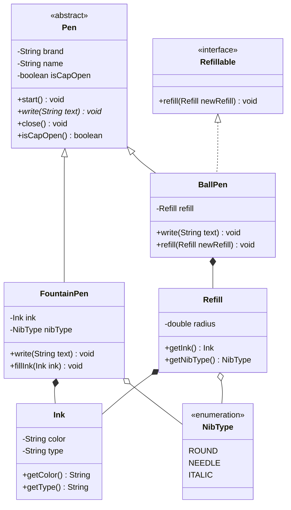

# Pen Design - Low Level Design (LLD)

This repository contains the design and implementation of a Pen following SOLID object-oriented design principles.

## Class Diagram



## SOLID Principles Applied

1. **Single Responsibility Principle (SRP):**
   - Details like `Ink` and `Refill` are separated from the `Pen` class. A Pen delegates the color and sizing semantics to the ink and refill models rather than holding everything intrinsically.

2. **Open / Closed Principle (OCP):**
   - We can easily extend the design to include a `GelPen` or a `Marker` by extending the abstract `Pen` class without modifying the existing base classes.

3. **Liskov Substitution Principle (LSP):**
   - The concrete classes (`BallPen`, `FountainPen`) can perfectly substitute the base class `Pen`. All objects are functional representations of a `Pen` offering `start()`, `close()`, and `write()` capabilities.

4. **Interface Segregation Principle (ISP):**
   - We separated the `refill()` behavior. Fountain Pens don't necessarily take standard `Refill` components (they take pure ink or specific cartridges). By creating a `Refillable` interface specifically designed for standard `Refill`s, we avoid forcing standard refill behaviors upon all pens.

5. **Dependency Inversion Principle (DIP):**
   - `Pen` uses abstract representations where possible. Concrete implementations manage how to associate ink with the writing capability.

## Getting Started

To execute the test case:

```bash
cd src
javac pen/*.java
java pen.Main
```
